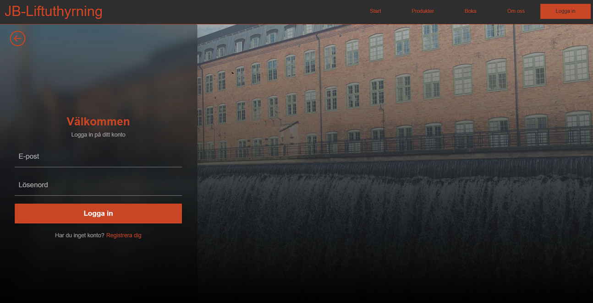
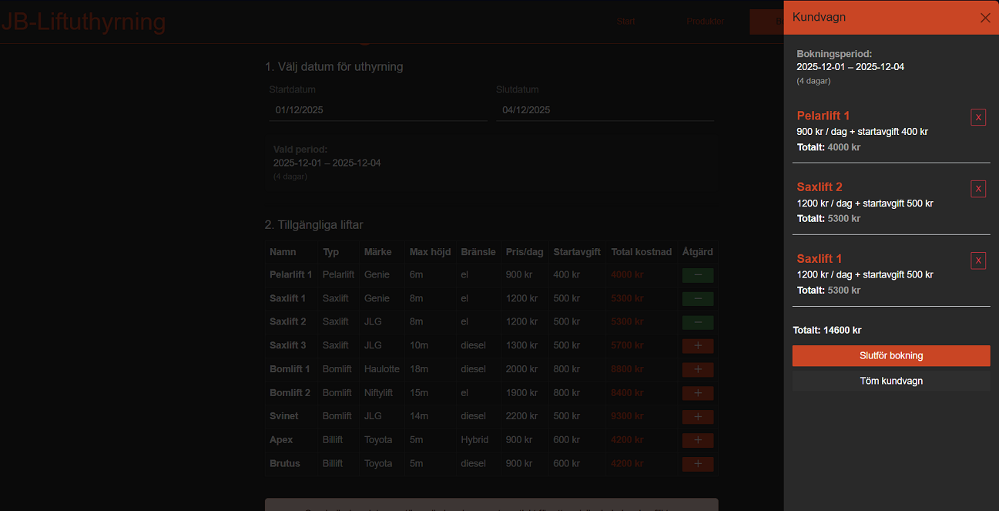
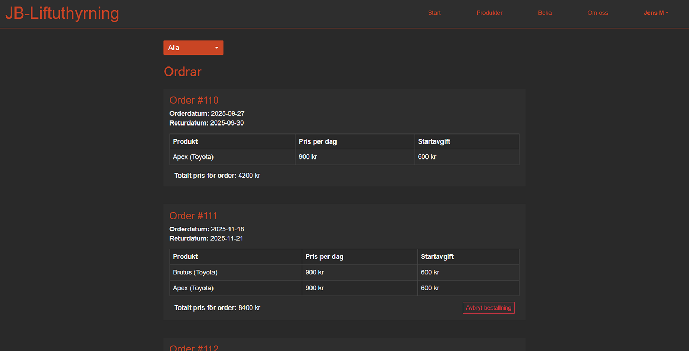
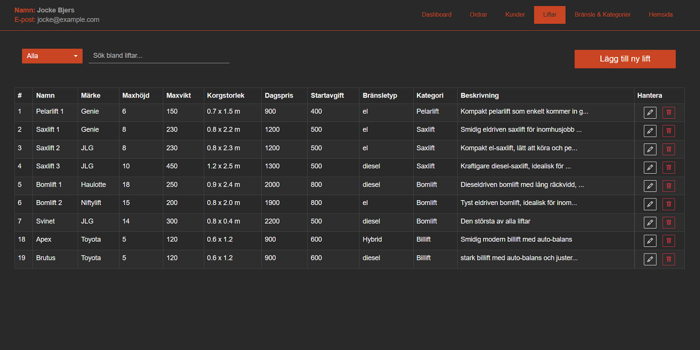
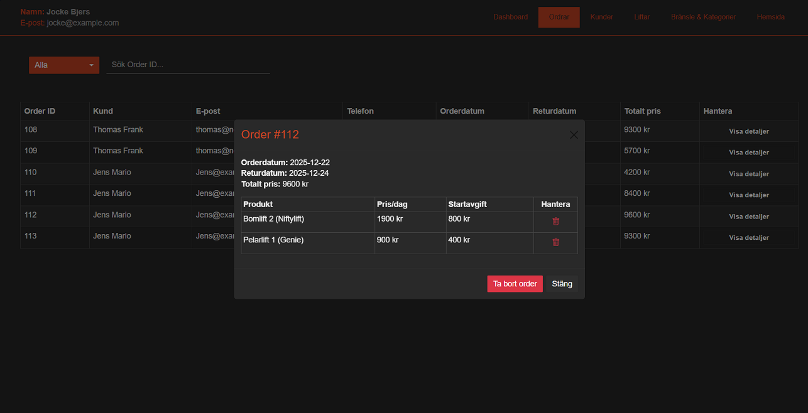
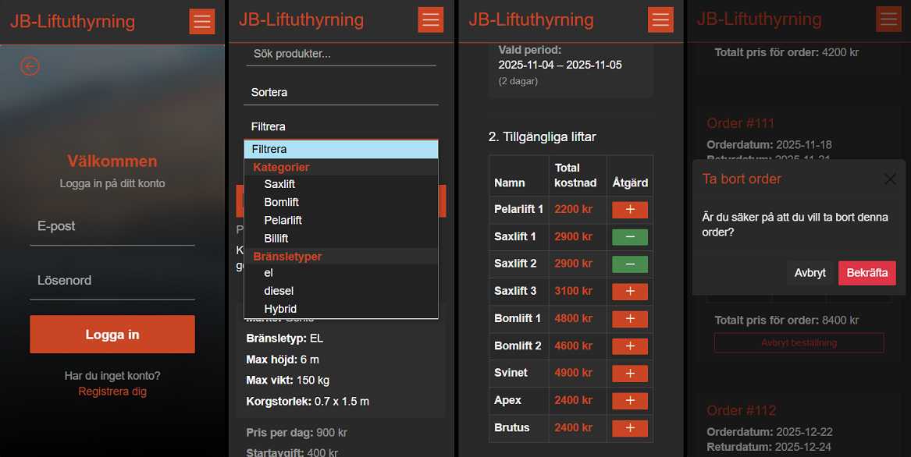
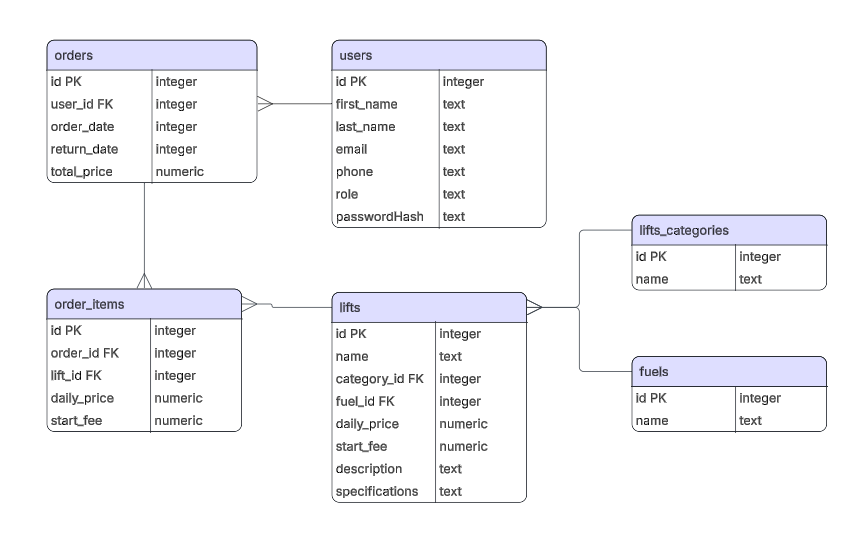

# JB Liftuthyrning

Detta är en webapp för att hantera liftuthyrningar i ett fiktivt företag. <br>
Användare kan lägga till en eller flera liftar i sin kundvagn, och se sina bokningar / avboka på sin profilsida. <br>
Admin kan lägga till och hantera ordrar, liftar, kategorier och användare. <br>


### Installation 
- Klona repo
```bash
git clone https://github.com/jockeBjers/jb-liftuthyrning.git
```

- Kom igång
```bash
npm install
npm run dev
```

sqlite-databasen startar när man kör npm run dev

## Logga in:
```
Admin
email: jocke@example.com
lösenord: 12345678

Användare
email: jens@example.com
lösenord: 12345678
```
<br>

# Bilder från projektet: 
    

## Logga in
<p align="center">
  
</p>

## Kundvagn
<p align="center">
  
</p>

## Profilsida
<p align="center">
  
</p>

## Adminsida
<p align="center">
  
</p>

## Adminsida orderhantering
<p align="center">
  
</p>

## Responsiv Design
<p align="center">
  
</p>

## ER-modell över databasen
<p align="center">
  
</p>

  <br>